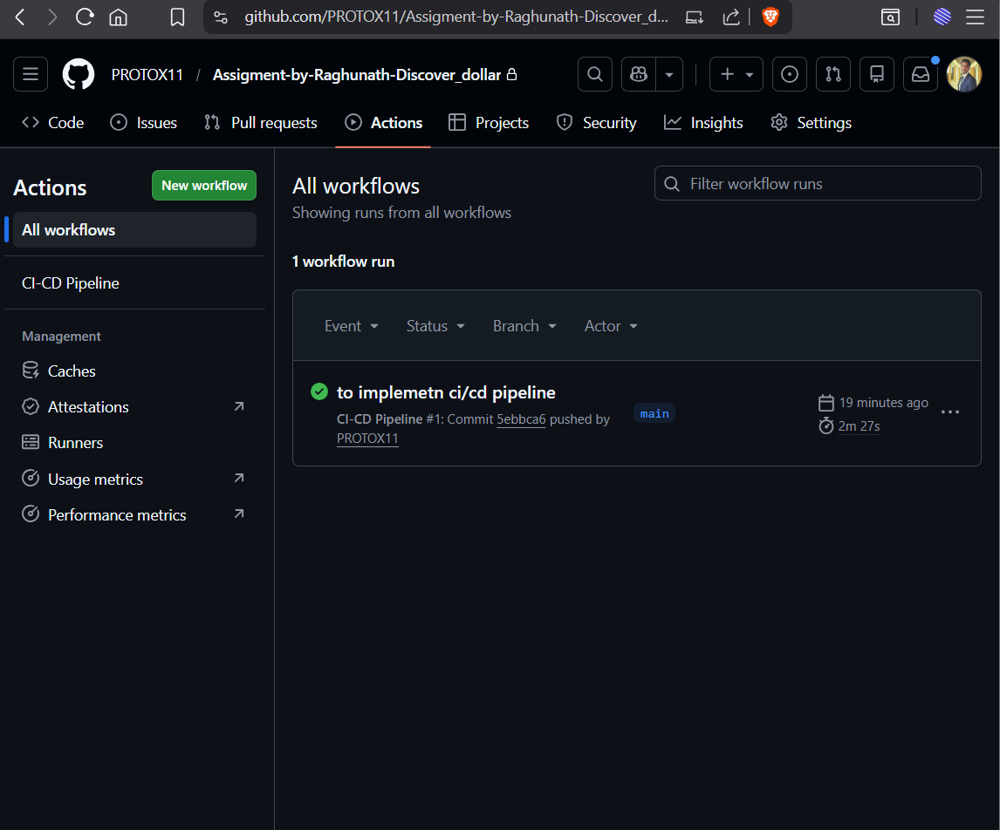
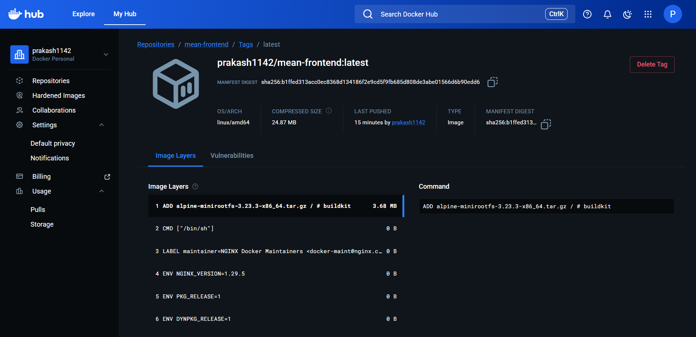
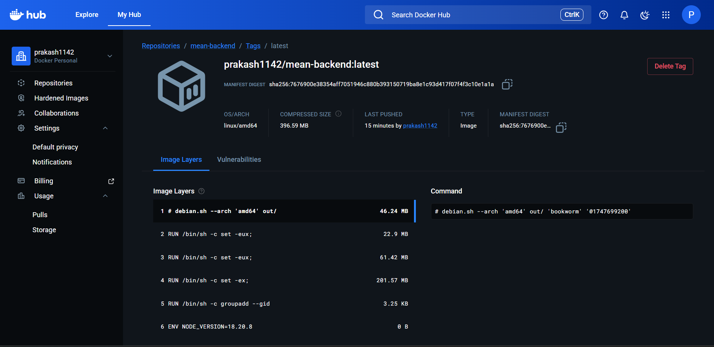
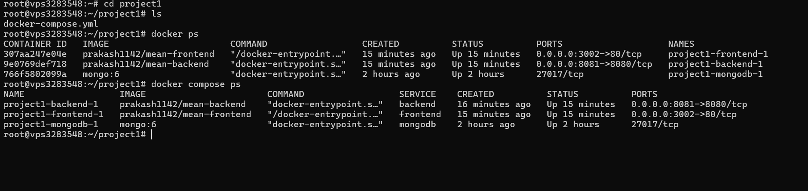
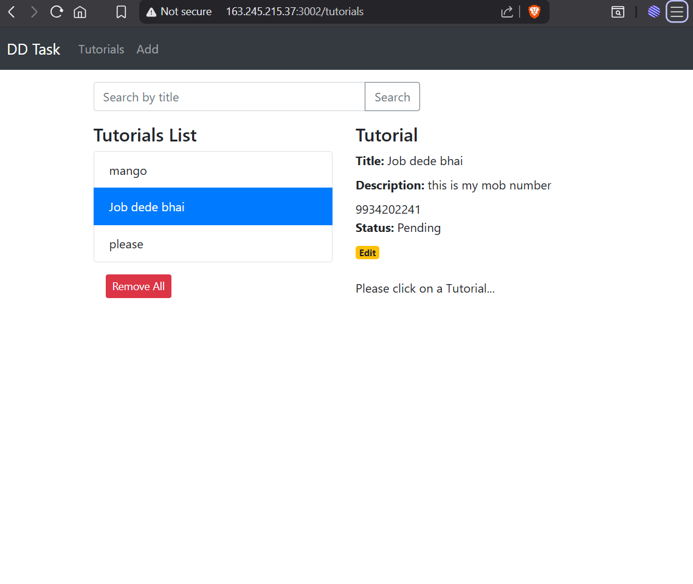
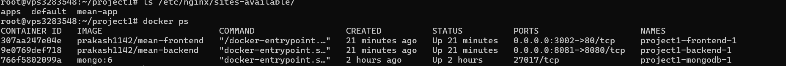

-- Project Overview --

This project is a fully containerized MEAN (MongoDB, Express, Angular, Node.js) application deployed on an Ubuntu VPS using Docker, Docker Compose, Nginx reverse proxy, and GitHub Actions CI/CD pipeline.

The application manages a collection of tutorials. Each tutorial contains:

- ID
- Title
- Description
- Published Status

Users can:

- Create tutorials
- Retrieve tutorials
- Update tutorials
- Delete tutorials
- Search tutorials by title

---

# 🏗️ Architecture Overview

Client Browser  
⬇  
Nginx Reverse Proxy (Port 80)  
⬇  
Angular Frontend (Docker Container)  
⬇  
Express Backend API (Docker Container)  
⬇  
MongoDB (Docker Container)

---

# 🐳 Docker Setup

## Backend Dockerfile

Location:

```
backend/Dockerfile
```

Backend runs:

- Node.js
- Express API
- MongoDB connection via Docker network

---

## Frontend Dockerfile

Location:

```
frontend/Dockerfile
```

Frontend:

- Angular production build
- Served using Nginx inside container

---

## Docker Compose

Location:

```
docker-compose.yml
```

Services included:

- mongodb (MongoDB official image)
- backend (Node + Express)
- frontend (Angular + Nginx)

To start manually:

```bash
docker compose up -d
```

---

# ⚙️ CI/CD Pipeline (GitHub Actions)

Workflow file:

```
.github/workflows/deploy.yml
```

Pipeline automatically performs:

1. Build backend Docker image
2. Push backend image to Docker Hub
3. Build frontend Docker image
4. Push frontend image to Docker Hub
5. SSH into VPS
6. Pull latest images
7. Restart containers using Docker Compose

Deployment is triggered on every push to the `main` branch.

---

# 🌐 Production Deployment

Server: Ubuntu VPS  
Containerization: Docker  
Orchestration: Docker Compose  
Reverse Proxy: Nginx

Application URL:

```
http://163.245.215.37:3002
```

---

# 🗄️ Database Configuration

MongoDB runs as a Docker container.

Connection string inside backend:

```
mongodb://mongodb:27017/dd_db
```

(`mongodb` is the Docker service name)

---

# 🖥️ Local Development Setup

## 🔹 Backend Setup

```bash
cd backend
npm install
node server.js
```

MongoDB configuration file:

```
backend/app/config/db.config.js
```

---

## 🔹 Frontend Setup

```bash
cd frontend
npm install
ng serve --port 8081
```

Frontend service file:

```
frontend/src/app/services/tutorial.service.ts
```

Local URL:

```
http://localhost:8081/
```

---

# 🔐 Security Implementation

- Docker images stored in Docker Hub
- SSH key-based authentication for CI/CD
- Secrets managed using GitHub Actions Secrets
- No sensitive credentials committed to repository

---

# 📸 Screenshots

Screenshots included in `/screenshots` directory:

---

## ✅ 1. GitHub Actions Successful Run


---

## ✅ 2. Docker Image Build & Push Logs



---

## ✅ 3. Running Containers (`docker ps`)


---

## ✅ 4. Application Working UI


---

## ✅ 5. Nginx Configuration & VPS Deployment Confirmation


---
---

# 🔄 Deployment Workflow

1. Developer pushes code to GitHub
2. GitHub Actions builds and pushes Docker images
3. GitHub connects to VPS via SSH
4. VPS pulls updated images
5. Containers restart automatically
6. Updated application becomes live

---

# 👤 Author

Prakash Kumar
Email - prakashkr2894@gmail.com
+91 9934202241 

DevOps Engineer Internship Assignment Submission
Thank you